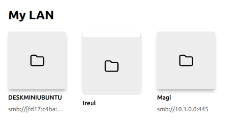

# Google Summer of Code 2022 - Work product summary

### Student Name
Leon Vitanos (leon.vitanos@gmail.com)

### Organization
Videolan

### Project
VLC Qt interface redesign

### Mentor
Pierre Lamot

## Overview
For the summer of 2022, I participated as a Google Summer of Code student under VideoLan, by contributing to the popular VLC media player. VLC is a free and open source cross-platform multimedia player, supporting a wide range of video and audio formats, and various streaming protocols. Many consider it as the best media player on the desktop. VLC currently counts more than four billion downloads, with at least a hundred million active monthly users.

## Project
The project I was involved in, with the title “VLC Qt interface redesign”, aims to improve the newly designed interface for Windows and Linux. Although the user interface is simple, flexible and lightweight, it has become old and outdated. The next major release 4.0 features an interface redesign to match a modern look and feel. VLC follows a modular structure, with over 500 modules, which makes it convenient to get involved in its development. VLC 4.0 uses Qt Qml as the underlying framework for frontend and C++ for backend.

In this article, I will explain all the tasks I was assigned from my mentor Pierre Lamot. Pierre was the perfect mentor for me, since I admire his knowledge in the field and he was very responsive to my questions, even if sometimes I tend ask a lot :see_no_evil:. Our email timing was really convenient, since I am a night owl and I pushed my changes after midnight. In the morning I would always have responses to my questions before waking up, which I could work on through the day. I had the chance to meet with Pierre in Paris via a covered bus-trip from the Netherlands, where Jean-Baptiste came at the office to present me a workshop. I couldn't wish for a better mentor, and organization to work with! 

## Work

### Preparation

In the Community Bonding Period I followed a [QML course for beginners](https://www.udemy.com/course/qml-for-beginners/), to learn the foundations of QML cross platform development. Often throughout coding, I had to jump back to remember some of these concepts. Outside of the official QT documentation, I also read some chapters of this [Qt5 book](http://qmlbook.github.io/). The ‘Model-View-Delegate’ and ‘Qt and C++’ chapters were especially helpful. 

When the coding period started, I had a video meeting with Pierre, where he showed me different features of VLC. After that I read the [developer onbarding’s documentation](https://chub.videolan.me/vlc-qt-onboarding/index.html) for VLC, written by Pierre. I followed another course, this time an [introduction to Git for GitLab projects](https://www.udemy.com/course/introduction-to-git-for-gitlab-projects/), show that i would refresh my git knowledge and learn some new concepts like rebasing.

### [Patch 1](https://code.videolan.org/videolan/vlc/-/merge_requests/2125) - Fix bugs on node/directory items

In this patch i fixed two bugs. I properly aligned an item if the secondary label was missing, and removed any use of the `vlc://nop` string on node/directory items as it didn't add any value.

| Before      | After |
| ----------- | ----------- |  
 | 
 | 

Commits: 
- [53306589](https://code.videolan.org/videolan/vlc/-/merge_requests/2125/diffs?commit_id=533065896fc0841d326d7982eca359b8c086918b)  qml: properly align item if secondary label is missing (fix [#26353](https://code.videolan.org/videolan/vlc/-/issues/26353))
- [b7fe7d66](https://code.videolan.org/videolan/vlc/-/merge_requests/2125/diffs?commit_id=b7fe7d66f0307b8c57d638469cd5a96fd14e4915) qml: hide the "vlc://nop" for node/directory items (fix [#26354](https://code.videolan.org/videolan/vlc/-/issues/26354))

### [Patch 2](https://code.videolan.org/videolan/vlc/-/merge_requests/2126) - Set correct color when CSD window buttons are pressed

When using the dark theme, pressing the CSD window buttons would make the background color darker instead of lighter

| Before      | After |
| ----------- | ----------- |  
 | 

Commits: 
- [53306589](https://code.videolan.org/videolan/vlc/-/merge_requests/2126/diffs?commit_id=bfca7654802a7b4bdc0bba52d2e43be4da1f67f0)  qml: set correct color when CSD pressed 

### [Patch 3](https://code.videolan.org/videolan/vlc/-/merge_requests/2141) - Redesign the no-media-library home page

This was originally my first assigned simple task, in order to get acquainted with the code base. Doing this task gave me the confidence that doing actual changes is not that hard!

I added an ‘Open File’ button at the no-media-library home page. After waiting for certain decisions from the designers, we also changed the icon of the drag-n-drop zone using a new artwork. Since the graphic was monochrome, I learned how to transform it into a font where each glyph corresponds to a pictogram. While adding the new artwork, i notice a lot of duplicate artworks. So i deleted 123 unused and obsolete artworks.

While doing task 1, I noticed a centering issue on a the EmptyLabelButton component, where it wouldn’t center properly, which I fixed.

| Before      | After |
| ----------- | ----------- |  
 | 

Commits:
- [d1dd4bf9](https://code.videolan.org/videolan/vlc/-/merge_requests/2141/diffs?commit_id=d1dd4bf9bf1947d11f289a09ca50f0d645d857fb) qml: add 'Open File' button and change dropzone icon at the no-media-library homepage
- [e8426b15](https://code.videolan.org/videolan/vlc/-/merge_requests/2141/diffs?commit_id=e8426b15be5cac15a6d213fde2775add7eab67b3) qml: fix centering issue with the EmptyLabelButton
- [5433a1a2](https://code.videolan.org/videolan/vlc/-/merge_requests/2141/diffs?commit_id=5433a1a2cfa104fba9629118eeed72ab8438e522) qt: remove unused and obsolete artworks

### [Patch 4](https://code.videolan.org/videolan/vlc/-/merge_requests/2244) - Chapters UI redesign 

This was my most enjoyable task. It made me understand the beauty of Qml components, and how difficult it is to optimize the code of your solution. Although from day two I had something visually close to an end result, it took 2-3 weeks to optimize it. It also introduced me to the backend development of VLC, which at that time was way out of my comfort zone. 

From simple red lines, the end result is rectangles which change size on hover with a visually pleasing animation.

| Before      | After |
| ----------- | ----------- |  
 | 

Commits:
- [8ed9912b](https://code.videolan.org/videolan/vlc/-/merge_requests/2244/diffs?commit_id=8ed9912b15577a5391189e13fe948a6d94bb90f0) qt/qml: chapters UI redesign
- [ce53cd1e](https://code.videolan.org/videolan/vlc/-/merge_requests/2244/diffs?commit_id=ce53cd1eb7b78d0189abce3a98565697a93e6069) qml: fix activeFocus issue by using invalidateFilter instead of invalidate

### [Patch 5](https://code.videolan.org/videolan/vlc/-/merge_requests/2380) - Use GridView for network devices (merge not accepted)

Although the initial thought was to show the network devices into a GridView instead of a horizontal ListView, another developer mentioned that a GridView will instantiate all items, which has an expensive and poor performance. That's why this MR was not merged, and Pierre started working on a more complex solution, outside the scope of this MR.

### [Patch 6](https://code.videolan.org/videolan/vlc/-/merge_requests/2378) - Delete KeyNavigableGridView

After trying to make KeyNavigableGridView work for patch 5, i understood (the hard way) that it's deprecated. Instead MainGridView had to be used, and KeyNavigableGridView to be deleted to avoid further confusion.

Commits:
- [e78e9f2f](https://code.videolan.org/videolan/vlc/-/merge_requests/2378/diffs?commit_id=e78e9f2f2e42563e674c198a8c83bc6cbb3e5dde) delete KeyNavigableGridView

### [Patch 7](https://code.videolan.org/videolan/vlc/-/merge_requests/2517) - Bookmarks bar, fix PointingTooltip bugs, SliderBar improvements

This patch was more difficult than the others, because outside of the amount of changes, i had a personal issue i had to deal with, a temporary mentor change (which had a different style of reviewing that i had to adjust) and two week vacations. All of these disoriented me and my productivity was not the highest. 

Sliderbar improvements is a slight adjustment to patch 4, to make the slider handle resize as much as the slider does.

The PointingTooltip seemed to appear on the other side of the screen when it's x position would supposedly be lower than zero (e.g a bookmark in the first seconds of a video). This was apparent in the chapters feature, but especially on bookmarks it was really easy to replicate. I fixed it by "glueing" the tooltip to the edge when it's x would supposedly surpass that edge. Same for the arrow of the tooltip, which is not allowed to move outside of the tooltip box.

The bookmarks task was even bigger than the chapters UI redesign. This time the backend wasn't already prepared for the QML side, and i had to understand how to register a QML type, and properly expose the data to QML without breaking the backend. I made my first custom component (Bookmarks.qml), which changed a lot of times (icons used, position, behaviour, etc..). After it was finished, i had to make sure that this feature is only loaded when the medialibrary is available. 

While creating the bookmarks component, i had to edit the ControlBar.qml a lot of times. The code it had was quit messy and difficult to understand, so i took the initiative to organize it and make it easier to understand.

| Before      | After |
| ----------- | ----------- |  
 | 

Commits:
- [f8b01d54](https://code.videolan.org/videolan/vlc/-/merge_requests/2517/diffs?commit_id=f8b01d545e0dee702f10be151d4ef2bd3da937bc) qml: fix progressBar radius and sliderHandle size
- [57e820c5](https://code.videolan.org/videolan/vlc/-/merge_requests/2517/diffs?commit_id=57e820c54cb0f6e7d4806f821235b7efbbe9ce37) qml: fix PointingTooltip position and arrow offset
- [3edfb1ac](https://code.videolan.org/videolan/vlc/-/merge_requests/2517/diffs?commit_id=3edfb1ac45d016bd93195e5810169a07ea1bb2da) qt/qml: register MLBookmarkModel as QML type
- [69f7122b](https://code.videolan.org/videolan/vlc/-/merge_requests/2517/diffs?commit_id=69f7122b7cfecb4eaef5ffd472cd14a7ba6323a1) qml: improve ControlBar code
- [06dbadef](https://code.videolan.org/videolan/vlc/-/merge_requests/2517/diffs?commit_id=06dbadef8425bf9e4cbfe32b6a68b5bd8a2b36f0) qt/qml: syntax & indentation
- [1a010cf9](https://code.videolan.org/videolan/vlc/-/merge_requests/2517/diffs?commit_id=1a010cf96cf2b136825f53dcc040091cc3a9b417) qt: disable add button on bookmarks dialog when media is stopped
- [d3161967](https://code.videolan.org/videolan/vlc/-/merge_requests/2517/diffs?commit_id=d316196774658746d5573d90b22f9ab7477da5d2) qt/qml: implementation of bookmarks bar under the SliderBar

### Patch 8 - Error notifications (not compeltely finished)

The current error message has several issues (pops up over miniplayer, no dismiss button, needs redesign). I started working on the error notification, which I redesigned and addded a counter on error messages that are repeated. There is still some work to do, like handling the miniplayer and showing all past errors in a dialog.
